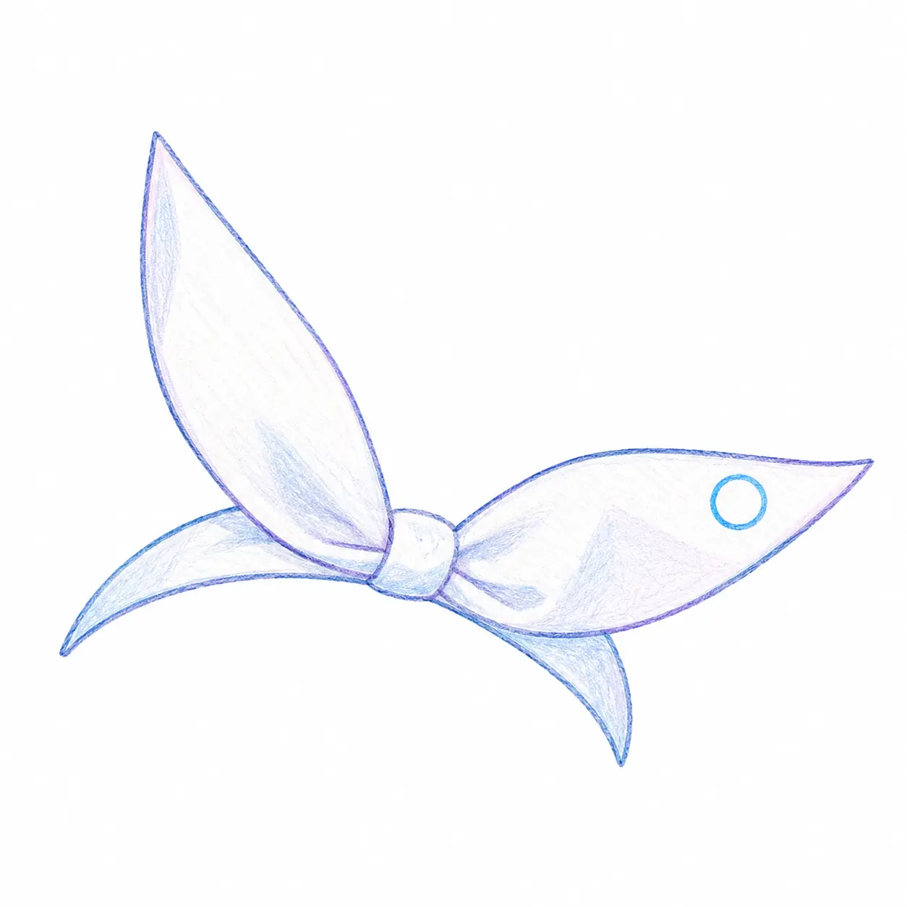

<!-- markdownlint-disable MD033 MD041 MD036 -->

# Arona

**Shared protocol types for the celestia-island platform**

<!-- markdownlint-enable MD033 MD041 MD036 -->

**[English](https://github.com/celestia-island/docs.celestia.world/blob/master/docs/en/arona/README.md)** &bull; **[简体中文](https://github.com/celestia-island/docs.celestia.world/blob/master/docs/zhs/arona/README.md)** &bull; **[繁體中文](https://github.com/celestia-island/docs.celestia.world/blob/master/docs/zht/arona/README.md)** &bull; **[日本語](https://github.com/celestia-island/docs.celestia.world/blob/master/docs/ja/arona/README.md)** &bull; **[한국어](https://github.com/celestia-island/docs.celestia.world/blob/master/docs/ko/arona/README.md)** &bull; **[Français](https://github.com/celestia-island/docs.celestia.world/blob/master/docs/fr/arona/README.md)** &bull; **[Español](https://github.com/celestia-island/docs.celestia.world/blob/master/docs/es/arona/README.md)** &bull; **[Русский](https://github.com/celestia-island/docs.celestia.world/blob/master/docs/ru/arona/README.md)**

> Part of the [celestia-island](https://github.com/celestia-island) ecosystem.

JSON-RPC 2.0 protocol types, TypeScript bindings, and the documentation hub. Consumed by entelecheia and shittim-chest.

## Documentation

Architecture, design, and guides live at [docs.celestia.world/en/arona](https://github.com/celestia-island/docs.celestia.world/tree/master/docs/en).

Source: [arona](https://github.com/celestia-island/arona).
