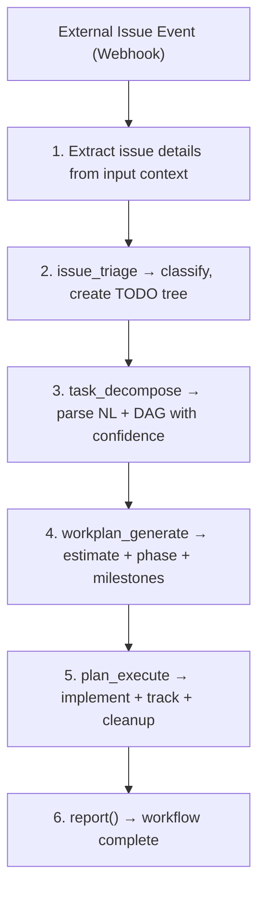

+++
name = "issue_driven_workflow"
agent = "hubris"

[description]
en = "Execute Issue-driven workflow from triage through planning, execution, and issue status update"
zh-Hans = "执行 Issue 驱动的工作流：从分诊到计划、执行、并更新 Issue 状态"
zh-Hant = "執行 Issue 驅動的工作流程：從分類到計畫、執行、並更新 Issue 狀態"
ja = "Issue 駆動ワークフローを実行：トリアージから計画、実行、Issue ステータス更新まで"
ko = "이슈 기반 워크플로우 실행: 분류부터 계획, 실행, 이슈 상태 업데이트까지"
fr = "Exécuter le flux Issue-driven du triage à la planification, l'exécution et la mise à jour du statut"
es = "Ejecutar flujo Issue-driven desde triaje hasta planificación, ejecución y actualización del estado"
ru = "Выполнение рабочего процесса Issue-driven: от сортировки до планирования, выполнения и обновления статуса"

[[related_tools]]
agent_name = "hubris"
tool_name = "report"

[[related_tools]]
agent_name = "hubris"
tool_name = "create_todo"

[[related_tools]]
agent_name = "hubris"
tool_name = "list_todo"

[[related_tools]]
agent_name = "hubris"
tool_name = "update_todo"

[[related_tools]]
agent_name = "aporia"
tool_name = "llm_chat"


[features]
execution_mode = "write"
location = "cosmos"
role = "coordinator"
+++

# issue_driven_workflow

End-to-end workflow triggered by an external Issue: triage → plan → execute via skill chain → update issue with results.

## Description

End-to-end workflow triggered by an external Issue. Triage → plan → execute via skill chain → update issue with results. The container is bound to the issue's binding ID for cross-restart traceability.

## Decision Philosophy

When executing issue-driven workflows:

- **Bias toward full resolution**: Do not execute a workflow that merely analyzes or documents an issue without moving it toward resolution. Every issue should either be resolved, escalated with a concrete plan, or explicitly deferred with justification. Activity without progress is waste.

- **Fearless experimentation**: If the initial triage and planning reveal that the issue requires a fundamentally different approach than initially assumed, restart the workflow from triage with corrected assumptions. Running the wrong plan to completion serves no one.

- **Fork-first MVP prototyping**: When the issue involves uncertain technical decisions (new library evaluation, architectural change feasibility), fork a container to prototype the solution before committing to a full execution plan. This reduces the risk of discovering a dead end late in the workflow.

- **Exploration before commitment**: When initial triage reveals multiple viable resolution paths, invest a brief analysis phase in SoP step 3 (Decision Making) to compare them before selecting the execution strategy. Choose the path with the highest confidence-to-effort ratio and document the rejected alternatives with rationale. Early exploration prevents late-stage pivots.

## SoP

1. **Information Collection** — Extract issue details from the input context. The trigger event carries the full issue payload: `binding_id`, title, body, labels, platform metadata.
1. **Threat Analysis** — Evaluate complexity, dependencies, and required agents. Determine if the issue spans multiple services or is self-contained.
1. **Decision Making** — Choose execution strategy: single-agent vs multi-agent skill chain. The standard pipeline is `task_decompose → workplan_generate → plan_execute`.
1. **Operation Execution** — Run the full skill chain: `task_decompose` → `workplan_generate` → plan_execute. The orchestrator handles container lifecycle.
1. **Result Verification** — Validate all tasks completed via `list_todo()`. Check quality of output against issue acceptance criteria.
1. **Report Generation** — Report results via `report()`. Use `write_to_var` for multi-line content, then `exec` to call `report()`.
1. **Knowledge Archiving** — Link TODO completion to issue closure. Store workflow pattern for similar future issues.

## Execution Flow



## Examples

### GitHub issue #234 triggers full fix workflow

```text
Input: Webhook → GitHub issue #234 "Memory leak in worker pool"
Steps:
  - Extract context: labels=bug, priority=high
  - issue_triage → critical bug, scope=worker-pool
  - task_decompose → 4 sub-tasks: reproduce, locate leak, fix, verify
  - workplan_generate → estimated ~3h, ordered execution plan
  - plan_execute → implement fix, track progress, merge branch
  - report → "Issue #234 resolved: memory leak fixed and verified"
```

### Feishu task triggers feature development

```text
Input: Feishu card → "Add export to PDF for reports module"
Steps:
  - Extract context: type=feature, scope=reports-module, priority=medium
  - issue_triage → feature request, priority=medium
  - task_decompose → 5 sub-tasks: design API, implement renderer, add tests, docs, deploy
  - workplan_generate → estimated ~8h, execution plan with dependencies
  - plan_execute → implement feature, track progress, merge branch
  - report → "Feishu task #567 completed: PDF export feature delivered"
```
