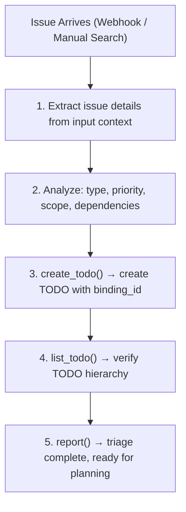

+++
name = "issue_triage"
agent = "hubris"

[[triggers]]
topic_pattern = "github.issues.*"

[[triggers]]
topic_pattern = "gitee.issues.*"

[[triggers]]
topic_pattern = "gitlab.issues.*"

[[next_action]]
agent = "hubris"
name = "task_decompose"

[description]
en = "Triage incoming issues, analyze priority and scope, create corresponding TODO items"
zhs = "对传入 Issue 进行分诊，分析优先级与范围，创建对应的 TODO 项"
zht = "對傳入 Issue 進行分類，分析優先級與範圍，建立對應的 TODO 項目"
ja = "受信 Issue のトリアージ、優先度とスコープを分析し、対応する TODO 項目を作成"
ko = "수신된 이슈를 분류하고, 우선순위와 범위를 분석하여 해당 TODO 항목 생성"
fr = "Trier les incidents entrants, analyser la priorité et la portée, créer les TODO correspondants"
es = "Clasificar incidencias entrantes, analizar prioridad y alcance, crear elementos TODO correspondientes"
ru = "Сортировка входящих проблем, анализ приоритета и охвата, создание соответствующих элементов TODO"

[[related_tools]]
agent_name = "hubris"
tool_name = "report"

[[related_tools]]
agent_name = "hubris"
tool_name = "create_todo"

[[related_tools]]
agent_name = "hubris"
tool_name = "list_todo"

[[related_tools]]
agent_name = "aporia"
tool_name = "llm_chat"


[features]
execution_mode = "read"
location = "cosmos"
+++

# issue_triage

Triage incoming issues from external platforms, analyze priority and scope, and create corresponding TODO items in the task tree.

## Description

When a new Issue arrives via Webhook or manual search, this skill analyzes its content, determines priority and scope, creates matching TODO items in the task tree, and optionally binds the container to the issue's binding ID.

## SoP

1. **Information Collection** — Extract issue details from the input context (title, body, labels, author, platform, `binding_id`). The trigger event already carries the full issue payload.
1. **Threat Analysis** — Assess scope: is it a bug, feature, refactoring? Estimate impact on existing components and dependencies.
1. **Decision Making** — Assign priority (critical/high/medium/low). Determine affected components and required skill chain.
1. **Operation Execution** — Create TODO item with `create_todo()`. Set metadata with `binding_id` reference for cross-restart traceability.
1. **Result Verification** — Confirm TODO created with correct hierarchy and attributes via `list_todo()`.
1. **Report Generation** — Report triage result via `report()`. Use `write_to_var` for multi-line content, then `exec` to call `report()`. See mcp.md Rule 1.
1. **Knowledge Archiving** — Store triage pattern for future reference.

## Execution Flow



## Examples

### Triage a GitHub bug report

```text
Input: GitHub issue #42 "Login fails with 500 error on SSO"
Steps:
  - Extract from context: labels (bug, critical), author
  - Analyze: type=bug, priority=critical, scope=auth-service
  - create_todo → "Fix SSO login 500 error" with binding_id=github:repo#42
  - report → "Triaged #42 as critical bug in auth-service"
```

### Triage a feature request from Gitee

```text
Input: Gitee issue "Add dark mode support"
Steps:
  - Extract from context: labels (enhancement), author
  - Analyze: type=feature, priority=medium, scope=UI
  - create_todo → "Implement dark mode" with binding_id=gitee:repo#17
  - report → "Triaged #17 as medium-priority feature for UI layer"
```
